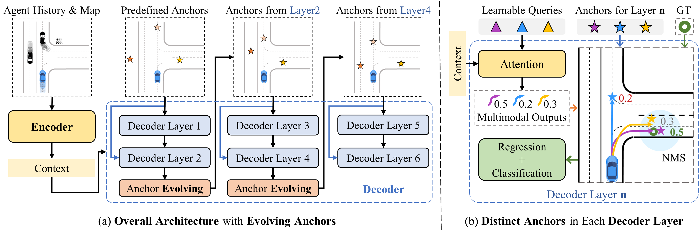
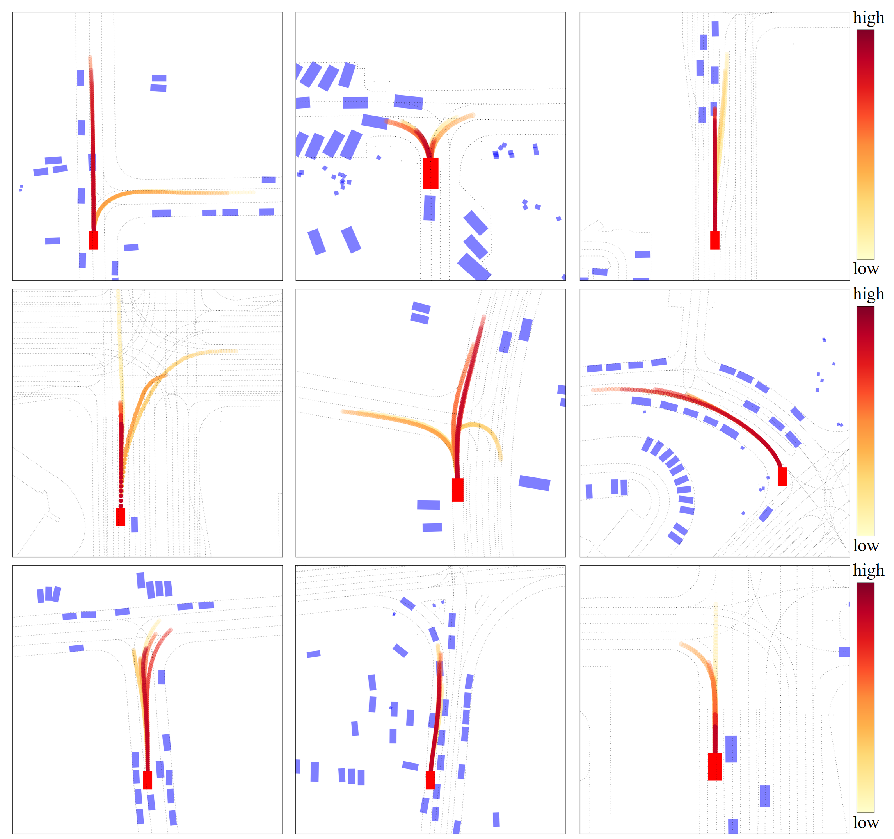

# EDA: Evolving and Distinct Anchors for Multimodal Motion Prediction




**Authors:** Longzhong Lin, Xuewu Lin, Tianwei Lin, Lichao Huang, Rong Xiong, Yue Wang

**Full-version paper including Appendix:** [[EDA (arXiv)]](https://arxiv.org/abs/2312.09501)

## Abstract
Motion prediction is a crucial task in autonomous driving, and one of its major challenges lands in the multimodality of future behaviors.
Many successful works have utilized mixture models which require identification of positive mixture components, and correspondingly fall into two main lines: prediction-based and anchor-based matching.
The prediction clustering phenomenon in prediction-based matching makes it difficult to pick representative trajectories for downstream tasks, while the anchor-based matching suffers from a limited regression capability.
In this paper, we introduce a novel paradigm, named **Evolving and Distinct Anchors (EDA)**, to define the positive and negative components for multimodal motion prediction based on mixture models.
We enable anchors to evolve and redistribute themselves under specific scenes for an enlarged regression capacity.
Furthermore, we select distinct anchors before matching them with the ground truth, which results in impressive scoring performance.
Our approach enhances all metrics compared to the baseline MTR, particularly with a notable relative reduction of 13.5\% in Miss Rate, resulting in state-of-the-art performance on the Waymo Open Motion Dataset.


## News
[2023-12] The paper is accepted by AAAI 2024.


## Getting Started

The codes will be released soon.


## Main Results


#### [Performance on the testing set of Waymo Open Motion Dataset](https://waymo.com/open/challenges/2023/motion-prediction/)
|  Model  | Soft mAP | mAP    | minADE | minFDE | Miss Rate |
|---------|----------------|--------|--------|--------|--------|
|EDA      | 0.4510   | 0.4401 | 0.5718 | 1.1702 | 0.1169    |

#### Performance on the validation set of Waymo Open Motion Dataset

| Model | Soft mAP | mAP    | minADE | minFDE | Miss Rate |
| ----- | -------- | ------ | ------ | ------ | --------- |
| EDA   | 0.4462   | 0.4353 | 0.5708 | 1.1730 | 0.1178    |

#### Qualitative Results




## Citation
If you find this work useful in your research, please consider cite:
```
@misc{lin2023eda,
      title={EDA: Evolving and Distinct Anchors for Multimodal Motion Prediction}, 
      author={Longzhong Lin and Xuewu Lin and Tianwei Lin and Lichao Huang and Rong Xiong and Yue Wang},
      year={2023},
      eprint={2312.09501},
      archivePrefix={arXiv},
      primaryClass={cs.CV}
}
```